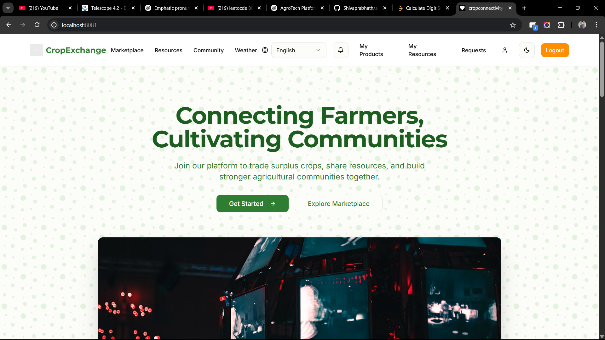
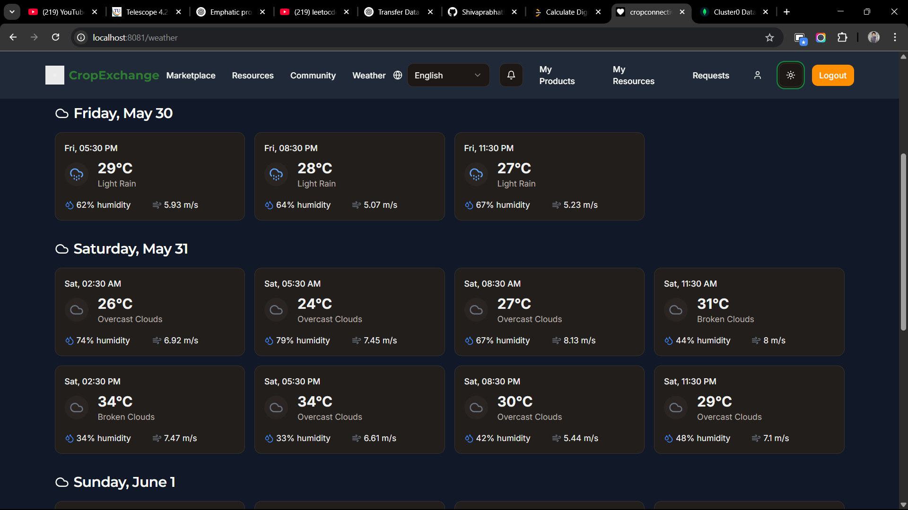
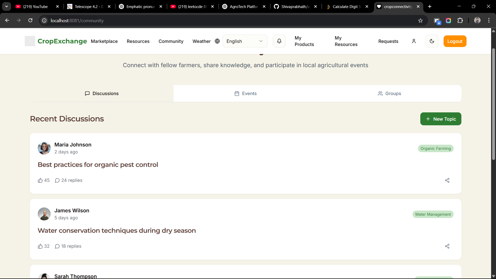
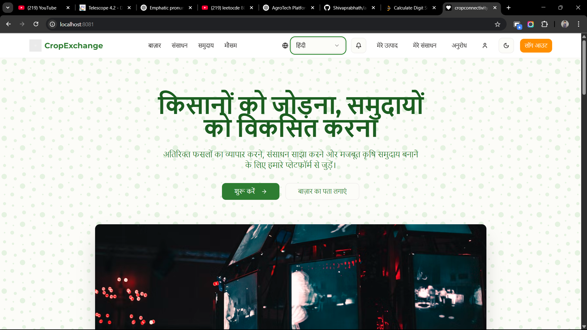
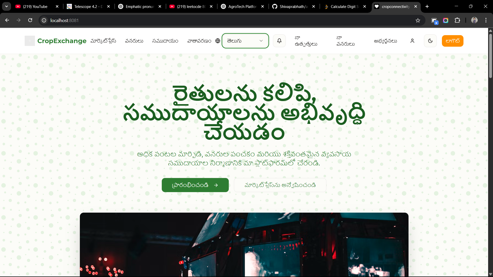

# 🌾 AgroTech - Empowering Small Farmers Through Technology

AgroTech is a community-based platform designed to support small and rural farmers by addressing critical challenges related to surplus crop distribution, resource sharing, and sustainable farming. Our goal is to reduce waste, lower costs, increase profits, and encourage collaboration within the farming community.

---

## 🚜 Problem Statement

Small farmers in rural areas often struggle to:

- Efficiently distribute surplus crops.
- Share resources like irrigation equipment or machinery.
- Reduce costs and financial strain due to lack of structured trade and collaboration mechanisms.

Without a platform for exchanging goods and services, farmers waste valuable resources and miss out on opportunities to collaborate and grow.

---

## ✅ Our Solution

AgroTech provides a structured, easy-to-use platform with the following key objectives:

- ♻️ **Reduce Waste**
- 💰 **Lower Costs**
- 📈 **Increase Profits**
- 🤝 **Encourage Collaboration**
- 💡 **Alleviate Financial Strain**
- 🌱 **Promote Sustainability**
  

---

## 🔑 Key Features

### 1. Surplus Crop Marketplace

Farmers can list their excess crops with details such as:

- Crop type
- Quantity
- Price
- Location

Buyers including local markets, supermarkets, or individuals can browse and filter listings, and purchase directly. This minimizes transportation costs and reduces crop wastage.


---

### 2. Resource Sharing System

Farmers can list farming tools, irrigation equipment, and other resources to:

- **Share**
- **Rent**
- **Barter**

Others in the community can browse, request, and negotiate terms directly, ensuring efficient resource utilization and fostering mutual support.


---

### 3. Bartering System

A unique trade mechanism where farmers can exchange resources or crops without monetary transactions.  
Example: One farmer trades irrigation equipment for another farmer’s surplus rice.  
This promotes cost-saving and enhances community collaboration.


---

### 4. Weather Forecast Alerts

Integrated with live weather APIs to provide:

- Real-time alerts about droughts, rainfall, and extreme conditions
- Notifications that help farmers plan and protect their crops efficiently
  
  

---

### 5. Community Forums

A dedicated space for farmers to:

- Post queries
- Share experiences
- Discuss best practices

This peer-to-peer learning environment strengthens the farming community and boosts productivity.


---

### 6. Multilingual Support

To ensure accessibility and inclusivity, the platform offers support for multiple languages, allowing farmers from diverse regions to:

- Navigate the platform easily
- Communicate and collaborate without language barriers
  
  

---

### 7. 🌿 AI-Powered Crop Disease Detection

A machine learning-based system that allows farmers to:

- Upload or capture images of crop leaves
- Automatically detect plant diseases using AI
- Get immediate feedback, diagnosis, and suggestions

<p float="left">
  
  
</p>
---

### 8. 🧠 RAG-Based Multilingual Chatbot

A Retrieval-Augmented Generation (RAG) chatbot trained on agricultural resources (e.g., ICAR–CRIDA data) that helps farmers:

- Get answers to farming-related queries
- Access information in **multiple regional languages**
- Understand best practices for crop management, irrigation, and pest control

## This chatbot acts as a personal farming assistant that’s always available and multilingual.

## This feature helps farmers take early action to protect crops and reduce yield loss.

---

## 🚀 Getting Started

Follow these steps to set up the **AgroTech** project on your local machine.

### 🧰 Prerequisites

Make sure you have the following installed:

- **Node.js** and **npm**: [Download & Install Node.js](https://nodejs.org/)
- **Python** and **pip**: [Download & Install Python](https://www.python.org/)

---

### 🔗 Clone the Repository

```bash
git clone https://github.com/Shivaprabhath/agro_tech.git
cd agro_tech
```

### ⚙️ Running the Project

📝 Important: You need to open three separate terminal windows/tabs in your IDE (e.g., VS Code) and run each part independently.

### 🖥️ Terminal 1 — Run the Frontend

```bash
cd /
npm install
npm run dev
```

### 🛠️ Terminal 2 — Run the Backend

```bash
cd client
npm install
npm run dev
```

### 🧠 Terminal 3 — Run the Python Diagnosis Server

```bash
cd python
pip install -r requirements.txt
python diagnosis_api.py
```

## 🛠️ Tech Stack

- **Frontend:** React.js
- **Backend:** Node.js, Express.js
- **Database:** MongoDB
- **APIs:** Weather API integration
- **Authentication:** Secure login/signup system
- **Hosting:** [Add your hosting platform here]

---

## 👨‍🌾 Target Users

- Small and marginal farmers
- Agricultural cooperatives
- Local markets and buyers
- Rural development agencies

---

## 🌍 Impact

AgroTech aims to build a sustainable, collaborative ecosystem that empowers farmers, increases efficiency, and enhances rural livelihoods.

---

## 📬 Contact

**Laxmi Sathwik Dandaboina**
📧 Email: dlsathwik@gmail.com
📱 Phone: +91 970585768

---

## 📄 License

[MIT License](LICENSE)

```

```
